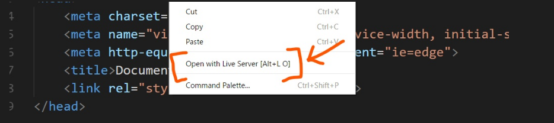

# Treinando Vue.js - Shop Vue.js

# Sobre o projeto
Esta é uma implementação básica de um site para compra de produtos. 
Inclui listagem de produtos, listagem dos produtos adicionados no carrinho, adição/remoção do carrinho e etc.  
Foi implementado usando Vue.js, consumindo dados através de um arquivo json.

# Objetivo
O objetivo foi fazer um sisteminha simples para praticar conceitos básicos do Vue.js

# Como executar o projeto?
Você irá precisar de um servidor HTTP por causa das requisições usando o fetch.

Se tentar abrir o sistema clicando duas vezes no index.html não irá funcionar.

Se estiver usando o VS Code, poderá usar a extensão [Live Server](https://marketplace.visualstudio.com/items?itemName=ritwickdey.LiveServer).

Após ter instalado o Live Server, abra o arquivo [index.html](index.html) e clicando com o botão direito no arquivo,
selecione "Open With Live Server" 

